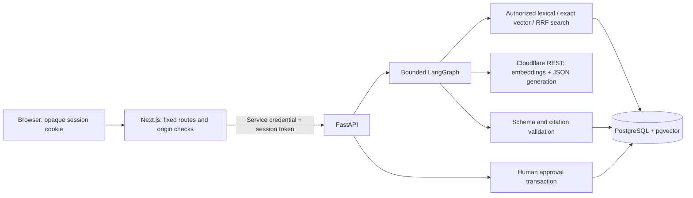

# Architecture and decisions

## Bounded workflow

The five nodes load_ticket, retrieve_evidence, generate_response, validate_response, and persist_result form an acyclic graph. One normal generation call and at most one eligible transient retry are allowed. There are no planner agents or arbitrary model-dispatched functions. Narrow operations are get_ticket, search_knowledge, and propose_internal_note. Only the trusted HTTP decision endpoint calls apply_approved_note.

Runs and pending proposals are application-level durable state. Refresh/restart can recover a completed answer and pending decision. An interrupted analysis does not resume at an arbitrary graph step; a still-running record is shown honestly and a new quota-limited analysis is needed. This avoids a checkpoint service for a five-node request.

## Retrieval and ingestion

RAG keeps answers inspectable and documents replaceable without fine-tuning. Original Markdown uses JSON frontmatter, validated metadata, heading/paragraph chunks and stable hashes. The bundled pinned BGE tokenizer enforces the 512-token embedding limit. Short documents remain short; longer passages target 250–350 tokens with no overlap required for this corpus. Embeddings use an explicit model/pooling/preprocessing manifest. Fixture vectors and live BGE cls vectors cannot be mixed.

For 24 documents, exact pgvector cosine search is sufficient. PostgreSQL full-text ranking uses ts_rank_cd, not BM25. Reciprocal rank fusion combines bounded candidates, with tenant and active-version filters applied before ranking. Four final chunks cap context. A distance cutoff can reject weak vector results but is not a calibrated factuality guarantee. Empty evidence abstains before generation; the model may also abstain on insufficient context.

## Transactions and retries

Short Psycopg connections disable prepared statements for transaction poolers and enforce connection/statement/lock timeouts. Retrieval releases the connection before HTTPX calls. A validated run and proposed note are committed together. Proposal content and ownership are immutable by trigger and column privilege.

Approval locks the proposal first, then the ticket. A duplicate approval of an already-applied proposal returns its existing note ID. A pending approval checks expiry and ticket version, inserts the unique note, increments the version and records the final decision atomically. Competing proposals for one ticket serialize on its row and the second becomes stale. Approval versus rejection serializes on the same proposal. This demonstrates one database effect, not global exactly-once distributed processing.

## Economical deployment

Two Vercel projects, one Python app, one Next.js BFF, one database per available environment, and one AI provider. No queue, Redis, hosted LangGraph service, external tracing account, browser Supabase client or auth product. LangGraph pulls several libraries transitively (including LangSmith/SDK packages); this app does not use those hosted services or tracing credentials.
