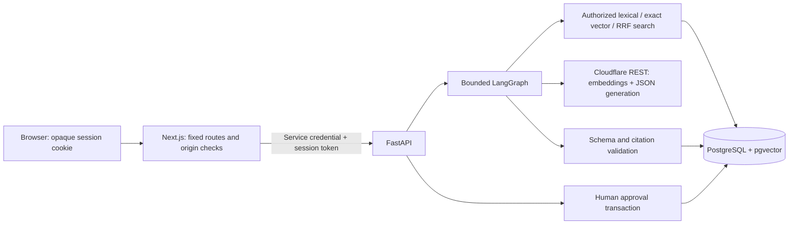
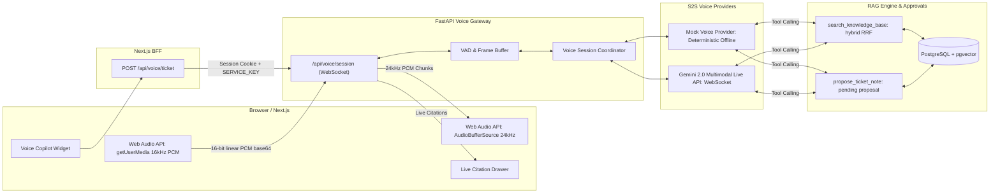

# Architecture and decisions

```mermaid
flowchart LR
    Browser[Browser: opaque session cookie] --> BFF[Next.js: fixed routes and origin checks]
    BFF -->|Service credential + session token| API[FastAPI]
    API --> Graph[Bounded LangGraph]
    Graph --> Search[Authorized lexical / exact vector / RRF search]
    Search --> DB[(PostgreSQL + pgvector)]
    Graph --> CF[Cloudflare REST: embeddings + JSON generation]
    Graph --> Validate[Schema and citation validation]
    Validate --> DB
    API --> Approval[Human approval transaction]
    Approval --> DB
```

## Bounded workflow

The five nodes load_ticket, retrieve_evidence, generate_response, validate_response, and persist_result form an acyclic graph. One normal generation call and at most one eligible transient retry are allowed. There are no planner agents or arbitrary model-dispatched functions. Narrow operations are get_ticket, search_knowledge, and propose_internal_note. Only the trusted HTTP decision endpoint calls apply_approved_note.

Runs and pending proposals are application-level durable state. Refresh/restart can recover a completed answer and pending decision. An interrupted analysis does not resume at an arbitrary graph step; a still-running record is shown honestly and a new quota-limited analysis is needed. This avoids a checkpoint service for a five-node request.

## Retrieval and ingestion

RAG keeps answers inspectable and documents replaceable without fine-tuning. Original Markdown uses JSON frontmatter, validated metadata, heading/paragraph chunks and stable hashes. The bundled pinned BGE tokenizer enforces the 512-token embedding limit. Short documents remain short; longer passages target 250–350 tokens with no overlap required for this corpus. Embeddings use an explicit model/pooling/preprocessing manifest. Fixture vectors and live BGE cls vectors cannot be mixed.

For 24 documents, exact pgvector cosine search is sufficient. PostgreSQL full-text ranking uses ts_rank_cd, not BM25. Reciprocal rank fusion combines bounded candidates, with tenant and active-version filters applied before ranking. Four final chunks cap context. A distance cutoff can reject weak vector results but is not a calibrated factuality guarantee. Empty evidence abstains before generation; the model may also abstain on insufficient context.

## Transactions and retries

Short Psycopg connections disable prepared statements for transaction poolers and enforce connection/statement/lock timeouts. Retrieval releases the connection before HTTPX calls. A validated run and proposed note are committed together. Proposal content and ownership are immutable by trigger and column privilege.

Approval locks the proposal first, then the ticket. A duplicate approval of an already-applied proposal returns its existing note ID. A pending approval checks expiry and ticket version, inserts the unique note, increments the version and records the final decision atomically. Competing proposals for one ticket serialize on its row and the second becomes stale. Approval versus rejection serializes on the same proposal. This demonstrates one database effect, not global exactly-once distributed processing.

## Hosted voice notes

The current hosted UI uses microphone → bounded PCM WAV upload → same-origin HTTPS BFF → authenticated Python transcription endpoint → Cloudflare Whisper. The user reviews the transcript before the normal RAG analysis. Quotes and schemas are validated, proposals are persisted, and only explicit approval saves an internal note. Raw audio is not retained in the database. Maximum recording length is 30 seconds; both transcription and analysis consume durable quota. The streaming architecture below is a legacy local experiment, not the hosted voice transport.

## Legacy local streaming architecture

```mermaid
flowchart LR
    subgraph Browser [Browser / Next.js]
        Mic[Web Audio API: getUserMedia 16kHz PCM]
        Spk[Web Audio API: AudioBufferSource 24kHz]
        Cards[Live Citation Drawer]
        UI[Voice Copilot Widget]
    end

    subgraph BFF [Next.js BFF]
        TicketGen[POST /api/voice/ticket]
    end

    subgraph Gateway [FastAPI Voice Gateway]
        WS["/api/voice/session (WebSocket)"]
        VAD[VAD & Frame Buffer]
        Coordinator[Voice Session Coordinator]
    end

    subgraph Providers [S2S Voice Providers]
        Mock[Mock Voice Provider: Deterministic Offline]
        Gemini[Gemini 2.0 Multimodal Live API: WebSocket]
    end

    subgraph RAG [RAG Engine & Approvals]
        SearchTool[search_knowledge_base: hybrid RRF]
        NoteTool[propose_ticket_note: pending proposal]
        DB[(PostgreSQL + pgvector)]
    end

    UI --> TicketGen -->|Session Cookie + SERVICE_KEY| WS
    Mic -->|16-bit linear PCM base64| WS
    WS -->|24kHz PCM Chunks| Spk
    WS -->|Live Citations| Cards
    WS <--> VAD <--> Coordinator
    Coordinator <--> Mock
    Coordinator <--> Gemini
    Mock & Gemini <-->|Tool Calling| SearchTool & NoteTool
    SearchTool & NoteTool <--> DB
```

### Duplex streaming protocol
The real-time voice gateway maintains a persistent full-duplex WebSocket connection at `/api/voice/session`. The protocol uses Pydantic v2 discriminated union events:
- `AudioFrame`: Encapsulates 16-bit linear PCM audio in base64 format (16kHz mono upstream from client; 24kHz mono downstream from assistant).
- `TranscriptEvent`: Incremental and final speech transcripts tagged by role (`user`, `assistant`, `model`).
- `CitationEvent`: Emitted immediately when RAG tools retrieve knowledge chunks, updating live UI cards with document titles, headings, and verbatim quotes.
- `ToolCallEvent` / `ToolResultEvent`: Structured function invocation dispatch between S2S speech models and backend RAG tools.
- `ControlEvent`: Lifecycle management events (`start`, `interrupt`, `turn_complete`, `ping`, `pong`, `error`).

### Secure voice ticket handshake
To strictly satisfy the repository invariant **Keep credentials server-only**, the browser never receives `SERVICE_KEY`. Instead:
1. When the agent initiates voice mode, the browser sends `POST /api/voice/ticket` through the same-origin Next.js BFF.
2. The BFF attaches the server-side `SERVICE_KEY` and session cookie.
3. The API validates credentials and issues a short-lived (60-second), single-use voice ticket.
4. The browser establishes the WebSocket connection directly using `?ticket={ticket_code}`.
5. Upon redemption, the ticket is invalidated; subsequent attempts with the same ticket fail with code `1008 Policy Violation`.

### Frame-accurate VAD and barge-in interruption
Voice Activity Detection is implemented in pure Python 3.13 without deprecated `audioop` dependencies:
- Linear PCM 16-bit samples are parsed using `struct.unpack` to compute normalized Root Mean Square (RMS) energy.
- An accumulator buffer normalizes arbitrary network chunk sizes into fixed 20ms frames (320 samples / 640 bytes).
- Speech detection triggers after 2 consecutive speech frames above threshold.
- End-of-turn speech completion triggers after 600ms of sustained silence.
- **Barge-in detection**: If user speech energy is detected for 3 consecutive frames while assistant audio is actively streaming, an interruption event is raised. The gateway immediately terminates active model generation, purges buffered audio queues, and notifies the client to cancel speaker playback.

### Zero-cost deterministic mock vs. live Gemini 2.0
The architecture supports zero-cost offline verification:
- **Mock Voice Provider**: Generates deterministic synthetic 24kHz PCM sine waves, triggers `search_knowledge_base` with fixture documents, and supports simulated barge-in cancellations. Operates fully offline in CI and local testing without external billing.
- **Gemini Live Provider**: Direct WebSocket adapter connecting to GCP Gemini 2.0 Multimodal Live API (`wss://generativelanguage.googleapis.com/...`). Active when `GEMINI_API_KEY` is present and `AI_MODE=live`.

### Safe mutation boundary in voice tools
Spoken dialogue tools invoke `search_knowledge_base` and `propose_ticket_note`:
- `search_knowledge_base` uses existing Reciprocal Rank Fusion hybrid search over pgvector cosine distance and lexical `ts_rank_cd`.
- `propose_ticket_note` inserts an immutable draft proposal with status `pending` in `evidence.proposals`. It **never** mutates the ticket or creates a note directly. The proposal remains subject to explicit human review and approval.

### Automated voice evaluations (SLAs)
The evaluation engine ([`apps/api/evidencedesk/voice/evals.py`](../apps/api/evidencedesk/voice/evals.py)) benchmarks real-time conversational performance:
- **Time-To-First-Audio (TTFA)**: Budget SLA is p95 < 600 ms (measured at ~31 ms locally).
- **Barge-in Cancellation Latency**: Budget SLA is p95 < 300 ms (measured at < 1 ms).
- **Spoken Citation Faithfulness**: 100% verification that spoken claims match cited knowledge passages without hallucinations.
- **Abstention Accuracy**: 100% compliance verifying that unanswerable queries explicitly abstain.

## Economical deployment

Two Vercel projects, one Python app, one Next.js BFF, one database per available environment, and one AI provider. No queue, Redis, hosted LangGraph service, external tracing account, browser Supabase client or auth product. LangGraph pulls several libraries transitively (including LangSmith/SDK packages); this app does not use those hosted services or tracing credentials.
